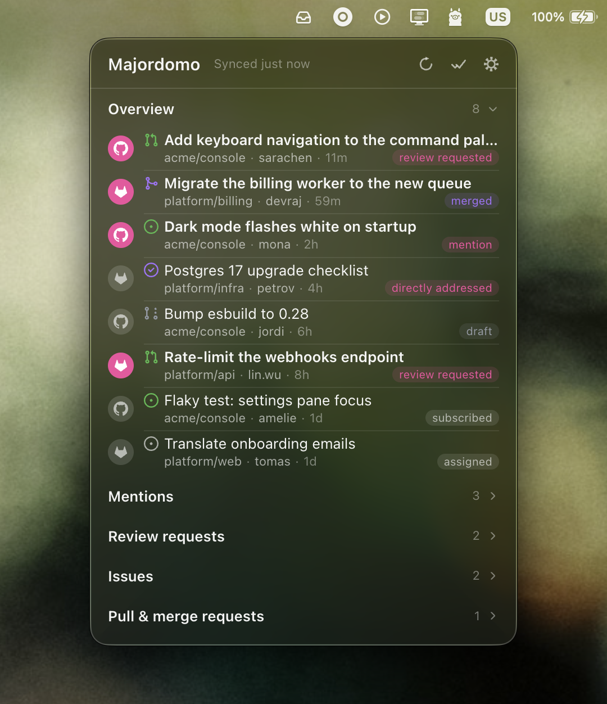

# Majordomo 🛎️

A little menu bar app that puts your GitHub and GitLab stuff — issues, PRs,
MRs, mentions — in one inbox. Works on macOS, Windows, and Linux.

<p align="center">
  
</p>

- 🔔 Get notified when someone mentions you or asks for a review
- 🗂 One list for everything, with groups per kind
- 🔒 Everything stays on your machine — read-only, no backend, tokens in
  the OS keychain

## Install

From the [latest release](https://github.com/gnugomez/majordomo/releases):

- **macOS**: download the `.dmg` for your chip (arm64 for Apple silicon,
  x64 for Intel) and drag `Majordomo.app` into
  `/Applications`. First launch: right-click → Open (the app isn't
  notarized), and enable Majordomo under System Settings → Notifications if
  you want notifications.
- **Windows**: run the `-Setup.exe` for your architecture.
- **Linux**: no prebuilt package yet — build it yourself (below).

## Tokens

Sign in from the settings pane by pasting a personal access token:

| Provider | Scope |
| --- | --- |
| GitHub | `notifications` (classic token) |
| GitLab (self-hosted) | `read_api` |

## Build

```sh
pnpm install
pnpm start         # run it
pnpm package       # build release/Majordomo-darwin-arm64/Majordomo.app
```

Want to help? See [CONTRIBUTING.md](CONTRIBUTING.md). Releases are described
in [RELEASING.md](RELEASING.md). Licensed under [GPL-3.0](LICENSE).
