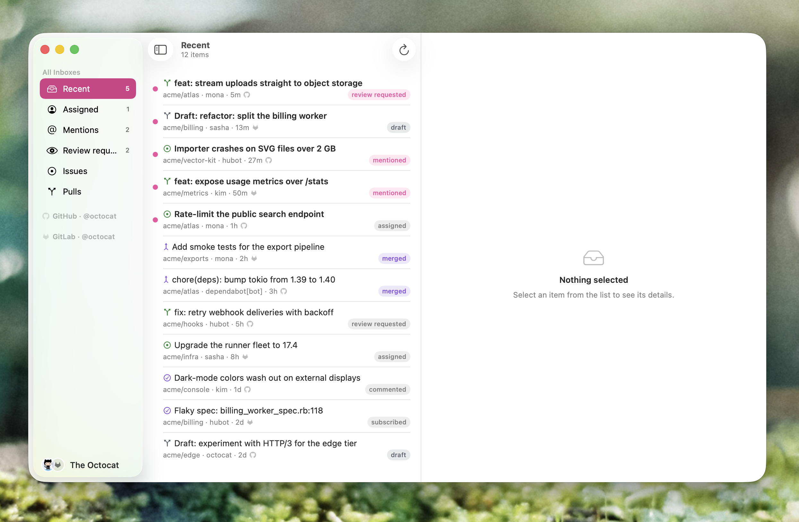
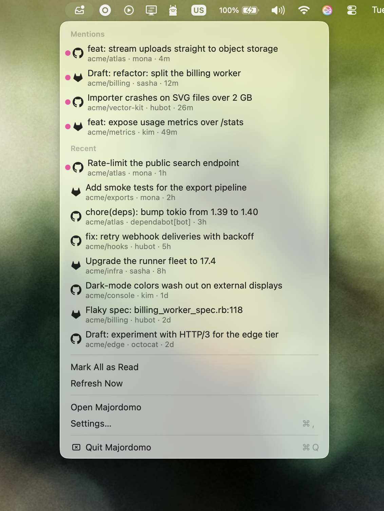

# Majordomo 🛎️

A native macOS menu bar app that puts your GitHub and GitLab stuff — issues,
PRs, MRs, mentions — in one inbox. Swift + SwiftUI, no dependencies beyond
the SDK.

<p align="center">
  
</p>

<p align="center">
  
</p>

- 🔔 Get notified when someone mentions you or asks for a review
- 🗂 One list for everything, with per-account sections and configurable
  inboxes — connect as many GitHub or GitLab accounts as you like
- 🔒 Everything stays on your machine — read-only, no backend, tokens
  encrypted at rest

## Install

With Homebrew (requires macOS 26, Apple silicon):

```sh
brew install --no-quarantine gnugomez/tap/majordomo
```

`--no-quarantine` because the app is not notarized; without it, macOS asks
for a one-time approval under System Settings → Privacy & Security.

Or build from source (requires Xcode 26):

```sh
./scripts/install.sh   # release build → /Applications/Majordomo.app
```

Two one-time papercuts of an unsigned build:

- **Keychain**: the token-encryption key lives in your Keychain; because the
  app is ad-hoc signed, a rebuilt binary re-prompts for access once per
  build — click **Always Allow**.
- **Notifications**: macOS shows no permission prompt for ad-hoc-signed
  apps — enable Majordomo once under System Settings → Notifications.

## Tokens

Add accounts from Settings (⌘,) by pasting a personal access token:

| Provider | Scope |
| --- | --- |
| GitHub | `notifications` (classic token) |
| GitLab (self-hosted) | `read_api` |

Tokens are stored AES-GCM encrypted in the app's data file; the key is a
single Keychain item.

Want to help? See [CONTRIBUTING.md](CONTRIBUTING.md). Releases are described
in [RELEASING.md](RELEASING.md). Licensed under [GPL-3.0](LICENSE).
